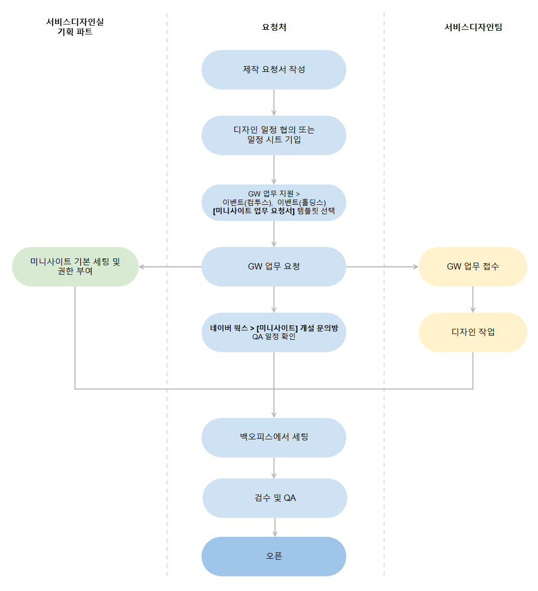

!!! danger "미니사이트 제작 전 가이드 내용을 숙지하시길 바랍니다."

##**미니사이트란?**
- 기획 및 디자인 리소스 투입만으로 빠른 시일 내에 약식 브랜드 사이트 제작이 가능한 브랜드 사이트 제작 툴입니다.
  

##**미니사이트 특징**
- 국가별, 언어별 분기가 가능하며, 라이브 중에도 별도 개발 작업 없이 바로 수정이 가능하여 운영이 용이합니다.

  
## **제작 프로세스**
- 미니사이트 백오피스 사용자는 그룹웨어 Hive ONE 백오피스 권한 신청이 필요합니다.
- 미니사이트 업무 요청 가이드: [컴투스](https://gw.com2us.com/emate_app/00001/bbs/b2302183754.nsf/view01/D946F255B24E7A4449258A0F001D43A7?opendocument&ui=webmail), [홀딩스](https://gw.com2us.com/emate_app/0000/bbs/b1609083917.nsf/view01/844FDD5D366FAAD649258B0F0022A017?opendocument&ui=webmail)
  

  

##**개설 및 사용 문의**
- 컴투스 서비스디자인실 기획파트
     
